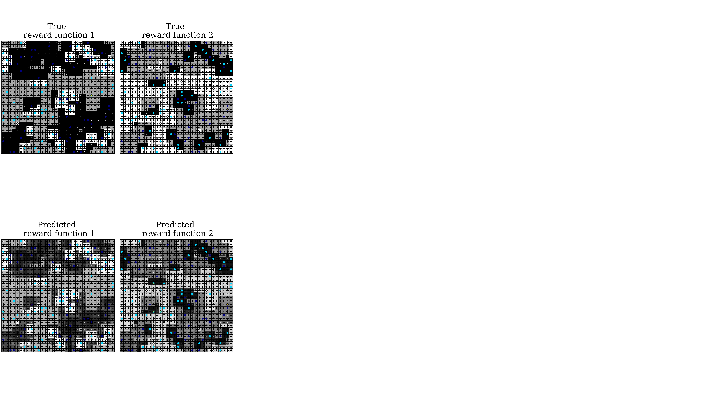

# DAMIIRL

This repository is the implimention the paper:

**Deep Adaptive Multi-Intention Inverse Reinforcement Learning</a>**
<br>
<a href="https://www.tue.nl/en/research/researchers/ariyan-bighashdel/">Ariyan Bighashdel</a>,
<a href="https://www.tue.nl/en/research/researchers/panagiotis-meletis/">Panagiotis Meletis</a>,
<a href="https://www.tue.nl/en/research/researchers/pavol-jancura/">Pavol Jancura</a>,
<a href="https://www.tue.nl/en/research/researchers/gijs-dubbelman/">Gijs Dubbelman</a>
<br>
Accepted for presentation at [ECML PKDD 2021](https://2021.ecmlpkdd.org/)

In this paper, two algorithms, namely "SEM-MIIRL" and "MCEM-MIIRL" are developed which can learn an a priori unknown number of nonlinear reward functions from unlabeled experts' demonstrations. The algorithms are evaluated on two proposed environments, namely "M-ObjectWorld" and "M-BinaryWorld". The proposed algorithms, and the environments are implemented in this repository.

If you find this code useful in your research then please cite
```
@inproceedings{gupta2018social,
  title={Deep Adaptive Multi-Intention Inverse Reinforcement Learning},
  author={Bighashdel, Ariyan and Meletis, Panagiotis and Jancura, Pavol and Dubbelman, Gijs},
  booktitle={IEEE Conference on Computer Vision and Pattern Recognition (CVPR)},
  number={CONF},
  year={2018}
}
```

## Dependencies
The code is developed and tested on Ubuntu 18.04 with Python 3.6 and PyTorch 1.9.

You can install the dependencies by running:

```bash
pip install -r requirements.txt   # Install dependencies
```

Implimentation of "Deep Adaptive Multi-intention Inverse Reinforcement Learning"

## Training
A simple experiment with a default set of parameters can be done by running:

```
python3 main.py
```
The following paramters are defined which can be set for various experiments:

- <b>miirl_type</b>: the main algorithm which can be either 'SEM' or 'MCEM', where 'SEM' : SEM-MIIRL and 'MCEM' : MCEM-MIIRL
- <b>game_type</b>: the environment which can be either 'ow' or 'bw', where 'ow' : M-ObjectWorld and 'bw' : M-BinaryWorld
- <b>sample_length</b>: the length of each demonstration sample
- <b>alpha</b>: the concentration parameter
- <b>sample_size</b>: the number of demonstrations for each reward/intention
- <b>rewards_types</b>: the intention/reward types which are in total six, ['A','B','C','D','E','F']
- <b>mirl_maxiter</b>: the maximum number of iterations

## Experiment
We conduct an experiment by setting the paramters as:
- miirl_type = 'SEM'
- game_type = 'ow'
- sample_length = 8
- alpha = 1
- sample_size = 16
- rewards_types = ['A','B']
- mirl_maxiter = 200

The following picture shows the true and predicted rewards:

<div align='center'>
  
</div>
